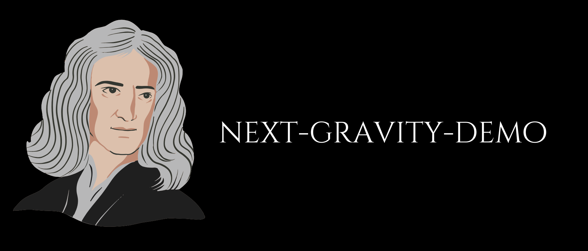
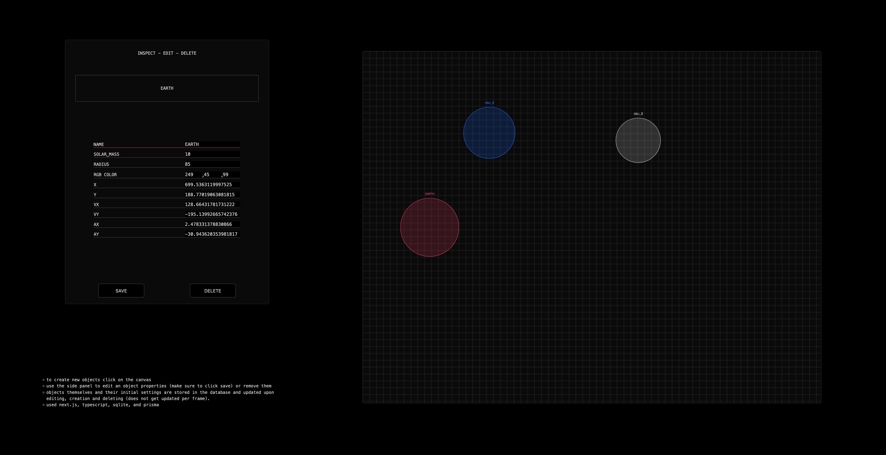

# *`NEXT-GRAVIRY-DEMO`*

## about
This full-stack web application demonstrates CRUD (Create, Read, Update, Delete) operations
for managing objects with properties like mass, radius, and name.
Users can create objects by clicking on a canvas, edit their attributes via a side panel, and save or delete changes.

## usage
- *Creating:* Click on the canvas to add new objects to the database.
- *Editing:* Use the side panel to modify an object's attributes (e.g., mass, radius, name) and save changes to persist updates.
- *Deleting*: Remove objects entirely via the side panel with a simple action.

## installation
you can use the already hosted version or you can:
- clone this repo:
```
git clone https://github.com/beddinao/next-gravity-demo.git && cd next-gravity-demo
```
- switch to local branch:
```
git switch local
```
- install dependencies and run:
```
npm install && npm run dev
```
- the default address is `localhost:3000`

## stack
- TypeScript
- Next.js
- Prisma
- SQLite

## preview

  
